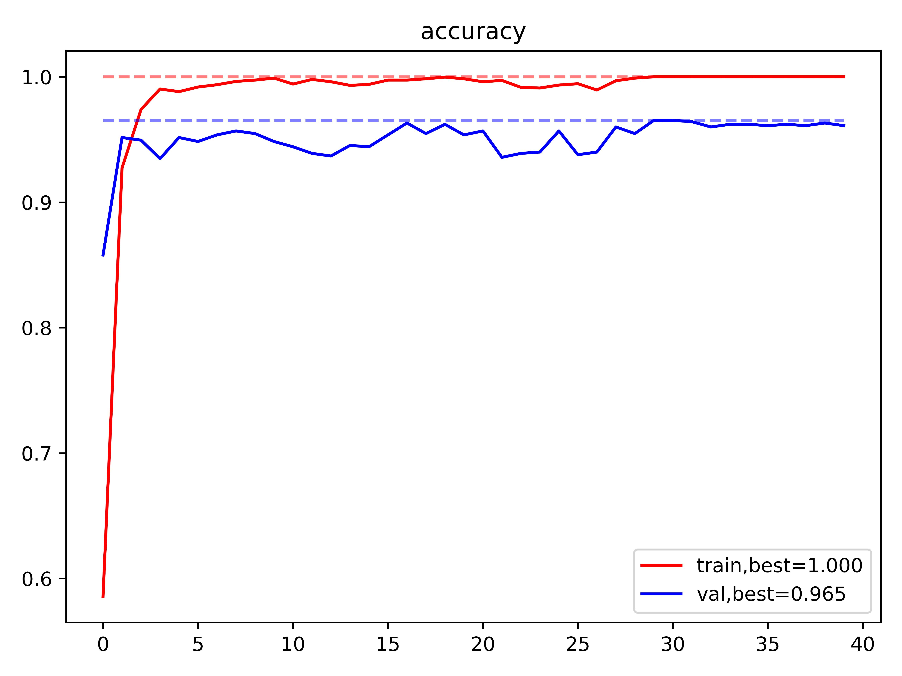

# Kaggle Competition: Plant Seedlings Classification

https://www.kaggle.com/competitions/plant-seedlings-classification/overview

third-party package :
- numpy 
- pandas 
- matplotlib
- torch, torchvision


## Method:
- using pretrianed __torchvision.model.resnet50__ as the based model to do transfer learning by fine-tuning its ```fc``` layer.

## Exectuion steps :
### setup.py :

- To download pytorch pretrained ResNet50 model 
    
- split the images in ```data/train/``` randomly into training data and test data, then store the splitting result.

- My split result: 

    

### deviceinfo.py :

Can list the infomation for your device, including :
- RAM size (GB)
- Number of CPUs (thread I think)
- Number of GPUs and their cuda index.

Will output to ```./deviceinfo.json```, please go to check it after execution this program.

### trainmodel.py :

To train the transfered ResNet50 model by modifing its fully connected layers (i.e. classifier)

command: 

```python trainmodel.py gpuid g```

- gpuid: the index of gpu that is going to use.
- e.g. ```python trainmodel.py gpuid 0```


__learning rate__ , __epoch__ and __FC layers__ can be set at the file ``` hyppara.json```

the log and the model will be store at ```model/transferRN50_id/``` .

### current best model:

- classifier:

    $\text{Linear}(2048, 12)$

#### training history:

Loss (CrossEntropy) :


Accuracy :




### testmodel.py :

To generate the ```submission.csv``` for testing images in ```data/test/```

command: 

```python testmodel.py gpuid g modelid m```
- gpuid: the index of gpu that is going to use.
- modelid: the version of model that is going to use. 
    - will concate "./model/transferRN50_" as prefix.
- e.g. ```python testmodel.py gpuid 1 modelid 2```
## Score on Kaggle :
