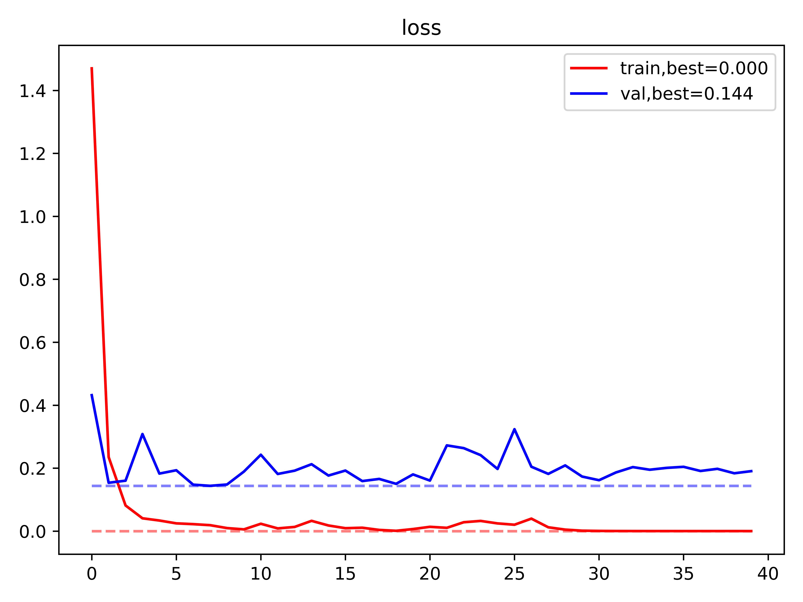

### Kaggle Competition: Plant Seedlings Classification

https://www.kaggle.com/competitions/plant-seedlings-classification/overview

third-party package :
- numpy 
- pandas 
- matplotlib
- torch, torchvision

** More detail are available at ```requirements.txt```


## Method:
- using pretrianed __torchvision.model.resnet50__ as the based model to do transfer learning by fine-tuning its ```fc``` layer.

## Exectuion steps :
### setup.py :

- To download pytorch pretrained ResNet50 model 
    
- split the images in ```data/train/``` randomly into training data and test data, then store the splitting result.

- My split result: 

    


### trainmodel.py :

To train the transfered ResNet50 model by modifing its fully connected layers (i.e. classifier)

__learning rate__ , __epoch__ and __FC layers__ can be set at the file ``` hyppara.json```

the log and the model will be store at ```model/transferRN50_id/``` .
- training history of current best model :

    classifier: 
    $$
    \text{Linear}(2048, 1024)\\
    \text{ReLU}()\\
    \text{Linear}(1024, 1024)\\
    \text{ReLU}()\\
    \text{Linear}(1024, 512)\\
    \text{ReLU}()\\
    \text{Linear}(512, 12)\\
    $$


    Loss (CrossEntropy) :

    

    Accuracy :

    


### testmodel.py :

To generate the ```submission.csv``` for testing images in ```data/test/```

## Score on Kaggle :
